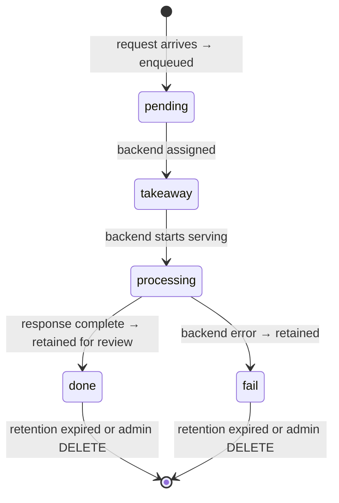

# What is the request lifecycle?

Every LLM request that reaches a cllama server is tracked in the router's
request queue from arrival to completion, so the admin API (`GET
/admin/queue`) and the web UI always show what the server is doing and what
it recently did.

## States

| State | Meaning |
| --- | --- |
| `pending` | The request is enqueued and the backend selector is scanning the registry for a backend that serves its model. |
| `takeaway` | A backend has been assigned ("taken away" for serving) but the upstream call has not started yet. In the future this state can also be set manually by an admin to pin a request so the selector never routes it and it can be operated on by hand. |
| `processing` | The assigned backend is actively serving the request. |
| `done` | The backend answered successfully. The entry lingers in the queue for review before being purged. |
| `fail` | The backend request failed (the recorded error explains why). The entry also lingers for review. |

## Retention of terminal states

`done` and `fail` entries are not dropped silently: they stay visible for
review and then expire. Their lifetimes are fixed at compile time in
`server/router.go`:

| Constant | `-1` | `0` | `>0` |
| --- | --- | --- | --- |
| `DoneRequestRetention` (default `5m`) | keep forever until removed by hand | drop as soon as it completes | keep this long, then purge |
| `FailedRequestRetention` (default `5m`) | keep forever until removed by hand | drop as soon as it fails | keep this long, then purge |

A background sweeper purges expired entries every second. While a positive
retention is configured, every successful request remains visible in
`GET /admin/queue` (and the UI's queued count) for that window; set the
constant to `0` to go back to an in-flight-only view.

## Admin operations

- `GET /admin/queue` lists all tracked requests with their `state`, assigned
  `backend`, and `error` (for failures).
- `DELETE /admin/queue/<id>` removes any request by hand — useful to clear
  retained `done` / `fail` entries, especially under `-1` (keep forever)
  retention.
- The web UI's **Request queue** tab shows the same data live (over SSE),
  with a per-row remove button.
